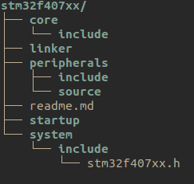

# Architecture

- [Introduction](#introduction)
- [Directories and files hierarchy](#directories-and-files-hierarchy)

## Introduction

This document describes basic architecture of drivers for each supported
microcontroller.

Architecture describes:

* how directories and files are organized;
* what a public API should look like, and what it should provide for outside
  callers;
* what should be private and what should be public.

What is the most important, architecture should be flexible and evolutionary.

## Directories and files hierarchy

Hierarchy is the same for each microcontroller model.

